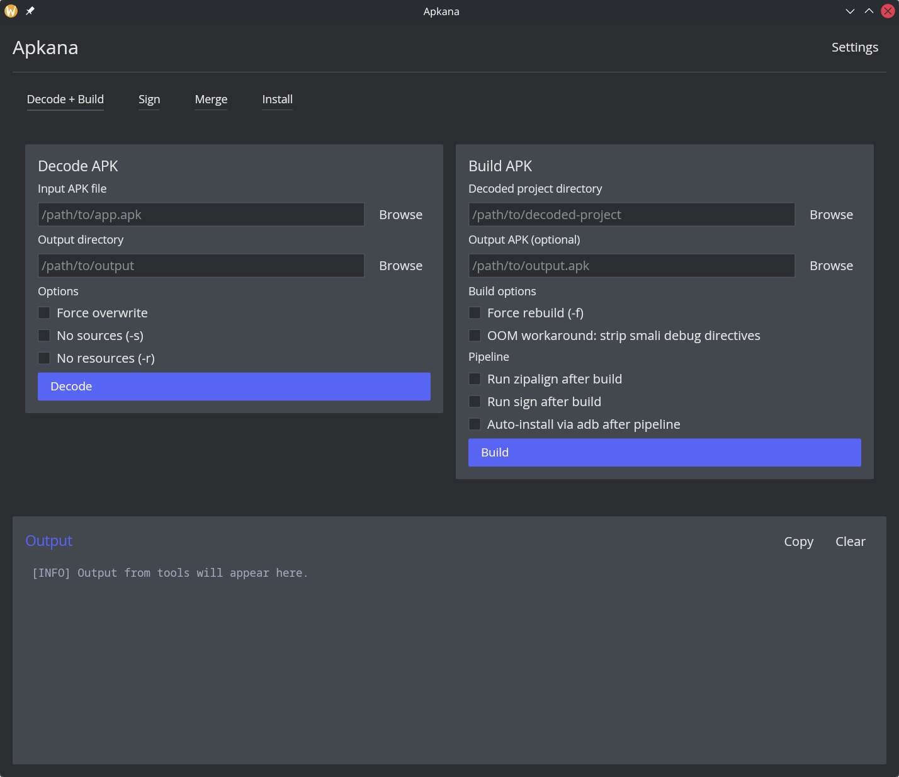
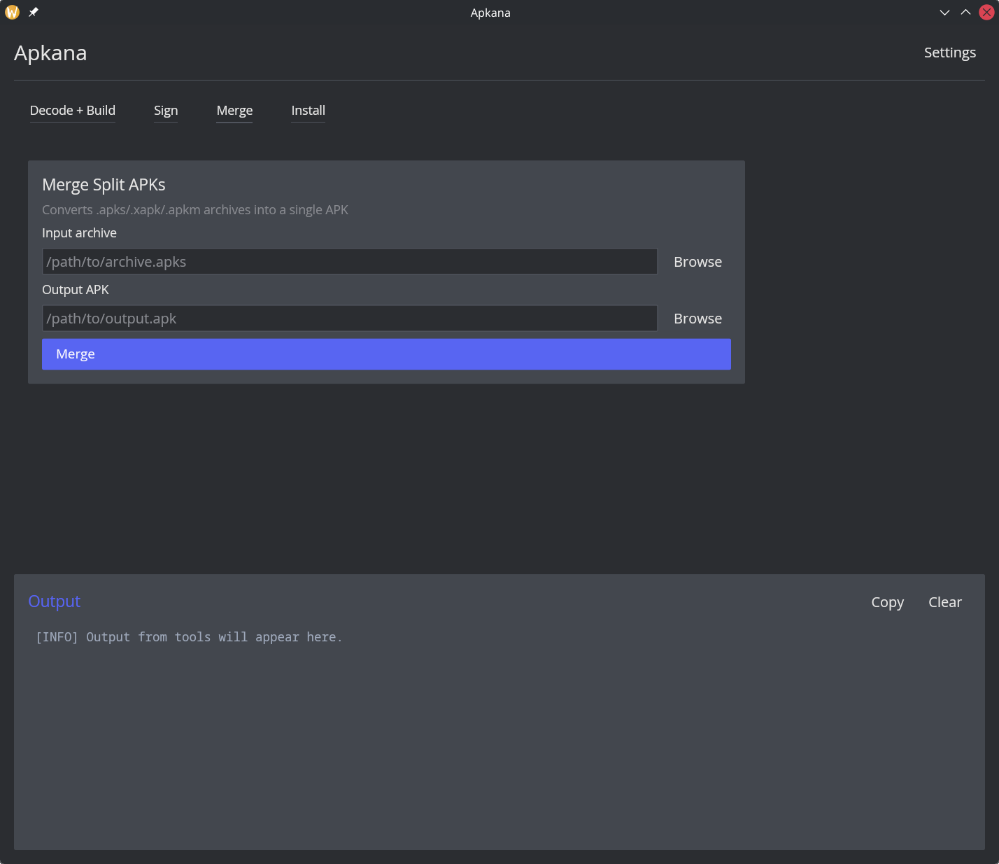
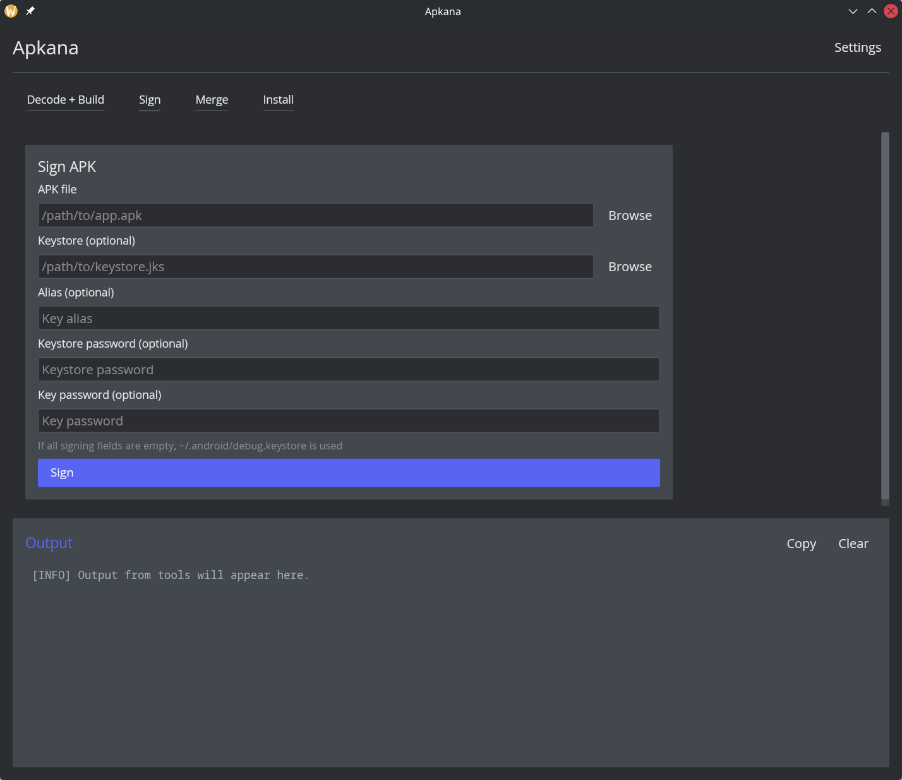

# Apkana

Desktop GUI for common Android APK workflows.

## What it does

- Decode and rebuild APKs
- Sign APKs
- Merge split packages (APKS/XAPK/APKM -> APK)
- Install APK 

## Screenshots





## Runtime requirements

- Java runtime
- `apktool`
- `apksigner`
- `zipalign`
- `adb`

## Local development

```bash
cargo check
cargo test
```

## Build

```bash
cargo build --release
```
